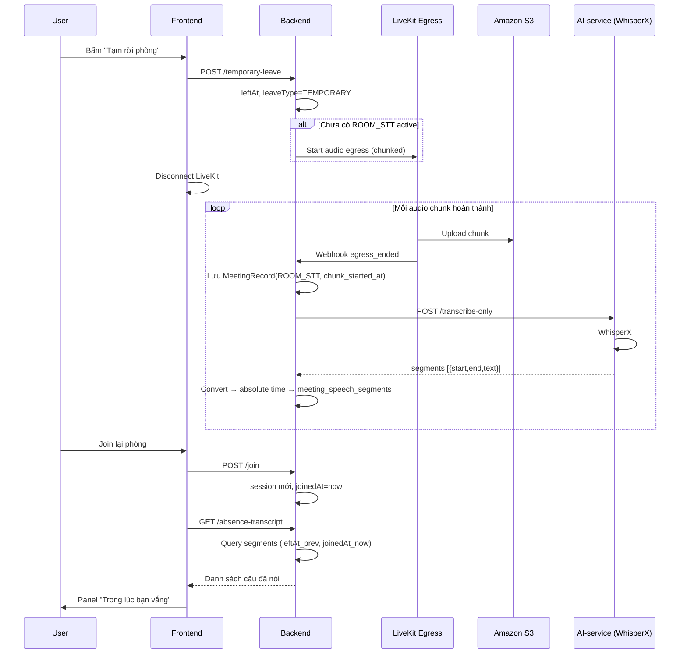
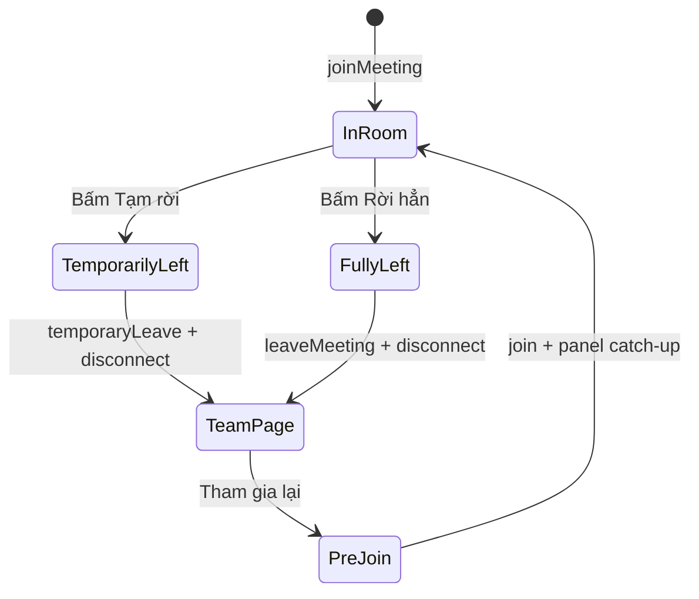
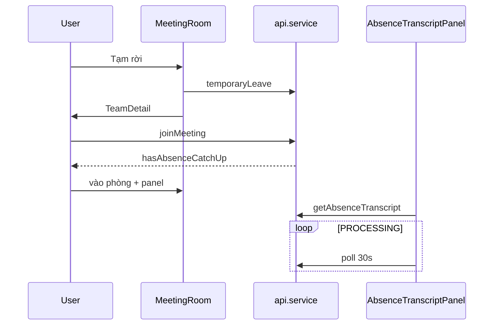

# Thiết kế: Tạm rời phòng họp & STT catch-up

Tài liệu mô tả case nghiệp vụ, kiến trúc và thiết kế kỹ thuật (backend + frontend) cho tính năng **tạm rời phòng họp** — cho phép người dùng rời cuộc họp đang diễn ra nhưng khi quay lại vẫn đọc được **lời nói của người khác** trong khoảng thời gian vắng mặt (chỉ STT, không tóm tắt).

Tài liệu này **tách bạch** với luồng **Ghi hình + Transcript + AI Summary** hiện có.

---

## Mục lục

1. [Bối cảnh & vấn đề](#1-bối-cảnh--vấn-đề)
2. [Hai luồng độc lập](#2-hai-luồng-độc-lập)
3. [Phân biệt Tạm rời vs Rời hẳn](#3-phân-biệt-tạm-rời-vs-rời-hẳn)
4. [Case nghiệp vụ](#4-case-nghiệp-vụ)
5. [Nguyên tắc thiết kế](#5-nguyên-tắc-thiết-kế)
6. [Kiến trúc tổng thể](#6-kiến-trúc-tổng-thể)
7. [Pipeline ROOM_STT](#7-pipeline-room_stt)
8. [Xử lý WhisperX & timestamp](#8-xử-lý-whisperx--timestamp)
9. [Catch-up theo session & công thức query](#9-catch-up-theo-session--công-thức-query)
10. [Mô hình dữ liệu](#10-mô-hình-dữ-liệu)
11. [API đề xuất](#11-api-đề-xuất)
12. [AI-service](#12-ai-service)
13. [Frontend — thiết kế & logic xử lý](#13-frontend--thiết-kế--logic-xử-lý)
14. [Tối ưu chi phí](#14-tối-ưu-chi-phí)
15. [Edge cases](#15-edge-cases)
16. [Lộ trình triển khai](#16-lộ-trình-triển-khai)
17. [So sánh với code hiện tại](#17-so-sánh-với-code-hiện-tại)

---

## 1. Bối cảnh & vấn đề

### Vấn đề

Trong cuộc họp trực tuyến (LiveKit), khi người dùng **rời phòng giữa chừng** (mất mạng, làm việc khác, tạm nghỉ), họ **không nghe lại được** phần audio/video đã phát trong lúc vắng.

Nhu cầu: khi **chủ động chọn tạm rời** và **quay lại**, hiển thị **bản chữ (STT)** những gì người khác đã nói trong khoảng thời gian đó.

### Không giải quyết bằng

| Cách | Lý do không dùng |
|------|------------------|
| Giữ WebSocket `/topic/meeting.{id}` sau khi rời | Tốn tài nguyên, mất khi disconnect |
| Replay video realtime | Không khả thi với LiveKit stream đã qua |
| Luồng Record + Summary hiện tại | Chỉ chạy sau khi host ghi hình, có bước tóm tắt — không phù hợp catch-up giữa chừng |
| Chat meeting | Chỉ có tin nhắn text, không có lời nói |

### Phạm vi

- **Có:** STT lời nói trong khoảng vắng (temporary leave)
- **Không:** Tóm tắt AI, ghi video đầy đủ, catch-up khi **rời hẳn**

---

## 2. Hai luồng độc lập

```
┌─────────────────────────────────────────────────────────────────┐
│  LUỒNG 1 — FULL_RECORD (đã có, giữ nguyên)                      │
│  Host bấm "Ghi hình" → LiveKit Egress video → S3                │
│  → AI: WhisperX transcript + Summary                            │
│  → Meeting_Transcripts + Meeting_Summary_*                      │
└─────────────────────────────────────────────────────────────────┘

┌─────────────────────────────────────────────────────────────────┐
│  LUỒNG 2 — ROOM_STT (mới)                                       │
│  User bấm "Tạm rời phòng" → hệ thống ghi audio chunk phòng      │
│  → S3 → AI: WhisperX transcribe-only (KHÔNG summary)            │
│  → meeting_speech_segments (timeline chung)                     │
│  → User join lại → query segments theo cửa sổ session           │
└─────────────────────────────────────────────────────────────────┘
```

| Tiêu chí | FULL_RECORD | ROOM_STT |
|----------|-------------|----------|
| Kích hoạt | Host thủ công | Tự động khi có người **tạm rời** |
| Định dạng | Video (mp4) | Audio only, chunk 2–3 phút |
| AI | Transcript + Summary | **STT only** |
| Đối tượng | Cả nhóm (xem lại sau) | **Từng user** tạm rời (filter theo thời gian) |
| `record_type` | `FULL_RECORD` | `ROOM_STT` |

---

## 3. Phân biệt Tạm rời vs Rời hẳn

### UI (MeetingRoom)

```
┌──────────────────────────────────────────┐
│  [Tạm rời phòng]    [Rời phòng hẳn]      │
└──────────────────────────────────────────┘
```

| Hành động | API | `leave_type` | Catch-up STT |
|-----------|-----|--------------|--------------|
| **Tạm rời phòng** | `POST /meetings/{id}/temporary-leave` | `TEMPORARY` | Có — khi join lại |
| **Rời phòng hẳn** | `POST /meetings/{id}/leave` (hiện tại) | `FINAL` | **Không** |

### Hành vi

**Tạm rời:**
- Cập nhật `leftAt` trên session participant hiện tại
- Ngắt kết nối LiveKit (client)
- Đảm bảo pipeline `ROOM_STT` đang chạy (nếu chưa)
- User có thể `joinMeeting` lại → tạo **session mới** (`sessionIndex + 1`)

**Rời hẳn:**
- Giữ logic `leaveMeeting` hiện tại
- Không bật catch-up, không hiện panel STT khi rời
- Host rời hẳn → vẫn theo rule hiện tại (có thể end meeting)

---

## 4. Case nghiệp vụ

### Case 1 — Một người tạm rời một lần

```
10:00  User A tạm rời     (leftAt = 10:00)
10:00–10:10  Người khác nói trong phòng
10:10  User A join lại    (joinedAt = 10:10, session mới)

→ Panel STT: segments từ 10:00 đến 10:10
```

### Case 2 — Nhiều người tạm rời lệch thời gian

```
        10:00    10:05    10:10    10:15
A rời:  [═══════════════]
B rời:           [═══════════════════]
A vào:                    ▲
B vào:                              ▲

Timeline STT chung (xử lý AI 1 lần / chunk):
  seg₁ 10:00–10:03
  seg₂ 10:03–10:06   ← overlap A & B
  seg₃ 10:06–10:09
  seg₄ 10:09–10:12
  seg₅ 10:12–10:15

User A query: spoken_at ∈ (10:00, 10:10)
User B query: spoken_at ∈ (10:05, 10:15)
```

**Không** tạo record/WhisperX riêng cho A và B — chỉ **filter khác nhau** trên cùng bảng segments.

### Case 3 — Cùng một người tạm rời nhiều lần

```
10:00  A tạm rời
10:05  A vào lại        → catch-up #1: 10:00–10:05
10:05–10:15  A trong phòng (nghe trực tiếp, không cần STT)
10:15  A tạm rời lần 2
10:30  A vào lại        → catch-up #2: 10:15–10:30
```

Mỗi lần vào lại chỉ hiện panel cho **cửa sổ vắng gần nhất** (`leftAt` session trước → `joinedAt` session hiện tại).

**Không** gộp 10:00–10:30 thành một khối.

### Case 4 — Rời hẳn

```
User B bấm "Rời phòng hẳn" lúc 10:20
→ leave_type = FINAL
→ Không có panel STT, không query catch-up
```

---

## 5. Nguyên tắc thiết kế

1. **Một timeline STT chung cho cả phòng** — không một LiveKit egress / một WhisperX job per user.
2. **Catch-up gắn participant session** — mỗi cặp `(leftAt, joinedAt)` là một cửa sổ query.
3. **Tách hẳn luồng Summary** — `ROOM_STT` không gọi API summary.
4. **Chỉ kích hoạt khi user chọn Tạm rời** — rời hẳn không làm gì thêm.
5. **Timestamp tuyệt đối** — WhisperX offset trong chunk phải được cộng `chunk_started_at` trước khi lưu DB.
6. **Query-time personalization** — N user vắng = N query SQL, không N lần AI.

---

## 6. Kiến trúc tổng thể



### Thành phần

| Thành phần | Vai trò |
|------------|---------|
| `MeetingService` | `temporaryLeave`, `joinMeeting`, điều phối ROOM_STT |
| `RoomSttService` (mới) | Quản lý egress audio chunk, enqueue AI |
| `AbsenceTranscriptService` (mới) | Lưu/query `meeting_speech_segments`, convert timestamp |
| `LiveKitWebhookService` | Nhận chunk xong → trigger STT |
| `TranscriptService` (cũ) | **Chỉ** FULL_RECORD + summary — không đổi logic catch-up |
| AI-service | Endpoint `transcribe-only` mới |

---

## 7. Pipeline ROOM_STT

### Khi nào bật

**Khuyến nghị (tiết kiệm):**

```
Đếm số participant có leave_type=TEMPORARY và leftAt != null (đang vắng)
  → count >= 1: bật / duy trì ROOM_STT
  → count == 0: tắt ROOM_STT (tuỳ chọn)
```

**Đơn giản hơn:** bật khi người đầu tiên tạm rời, tắt khi meeting kết thúc.

### Chunk audio

| Tham số | Giá trị đề xuất |
|---------|-----------------|
| Định dạng | Audio only (ogg/mp3/wav) |
| Độ dài chunk | 2–3 phút |
| Lưu trữ | S3 (có thể xóa sau khi STT xong) |
| Số egress đồng thời / meeting | 1 (`ROOM_STT`) |

### Luồng xử lý chunk

```
1. LiveKit egress kết thúc chunk N
2. Webhook → Backend
3. INSERT Meeting_Records (
     record_type = ROOM_STT,
     chunk_index = N,
     chunk_started_at = T0,
     status = PROCESSING
   )
4. Gọi AI transcribe-only (s3_url)
5. Nhận segments → convert absolute time → INSERT meeting_speech_segments
6. UPDATE record status = COMPLETED
7. (Tuỳ chọn) Xóa file S3 chunk
8. Bắt đầu chunk N+1 nếu ROOM_STT vẫn active
```

---

## 8. Xử lý WhisperX & timestamp

### 8.1. Ký hiệu

| Ký hiệu | Ý nghĩa |
|---------|---------|
| `T_chunk` | `chunk_started_at` — thời điểm bắt đầu ghi audio chunk (datetime tuyệt đối) |
| `s.start`, `s.end` | Offset giây (float) WhisperX trả về, tính từ **đầu file chunk** |
| `T_start`, `T_end` | Thời điểm tuyệt đối của segment sau khi convert |
| `W_start`, `W_end` | Cửa sổ catch-up: `leftAt` session trước → `joinedAt` session hiện tại |
| `epoch(x)` | Chuyển datetime `x` sang Unix timestamp (giây, có thể dùng millisecond) |

### 8.2. Input từ AI-service (offset trong file chunk)

WhisperX trả về mảng JSON, mỗi phần tử:

```json
{"start": 0.031, "end": 24.466, "text": "..."}
```

`start` / `end` là **giây** (float), gốc `0` = đầu file chunk audio (~2–3 phút).

**Ví dụ thực tế** (một chunk ~226 giây):

```json
[
  {"start":0.031,"end":24.466,"text":"Từ 2002 đến tháng 5 năm 2023..."},
  {"start":30.524,"end":52.023,"text":"Sau khi tốt nghiệp..."},
  {"start":52.867,"end":78.196,"text":"Kiến nhẫn, chôm chờ..."},
  {"start":78.601,"end":86.363,"text":"Thất nghiệp, làm trái ngành..."},
  {"start":86.718,"end":114.123,"text":"kiểu trái với cái ngành mình học..."},
  {"start":115.27,"end":141.697,"text":"Mặng có trong tay..."},
  {"start":141.697,"end":165.254,"text":"Tất nhiên, trong những bài tư vấn..."},
  {"start":168.427,"end":189.605,"text":"Mình tức nghiệp thường đảo sư phạm..."},
  {"start":190.567,"end":218.883,"text":"Tiếp tác một chính tế..."},
  {"start":218.883,"end":226.578,"text":"thì gọi là có cái kích xe..."}
]
```

### 8.3. Công thức lưu DB (ingest — chạy 1 lần khi nhận WhisperX)

Với mỗi segment `s` trong chunk có `chunk_started_at = T_chunk`:

```
T_start = T_chunk + s.start (giây)
T_end   = T_chunk + s.end   (giây)
```

**Java (khuyến nghị dùng `Instant` / `Duration` để tránh lỗi float):**

```java
Instant tStart = chunkStartedAt.plusNanos((long) (s.getStart() * 1_000_000_000L));
Instant tEnd   = chunkStartedAt.plusNanos((long) (s.getEnd()   * 1_000_000_000L));
```

**Hoặc dùng epoch giây (dễ so sánh trong SQL):**

```
epoch(T_start) = epoch(T_chunk) + s.start
epoch(T_end)   = epoch(T_chunk) + s.end
```

**INSERT** mỗi segment thành 1 dòng `meeting_speech_segments`:

```text
(meeting_id, room_stt_record_id, spoken_at_start, spoken_at_end, text)
```

### 8.4. Ví dụ convert — giả sử `T_chunk = 10:00:00`

| # | s.start | s.end | T_start | T_end |
|---|---------|-------|---------|-------|
| 1 | 0.031 | 24.466 | 10:00:00.031 | 10:00:24.466 |
| 2 | 30.524 | 52.023 | 10:00:30.524 | 10:00:52.023 |
| 3 | 52.867 | 78.196 | 10:00:52.867 | 10:01:18.196 |
| 4 | 78.601 | 86.363 | 10:01:18.601 | 10:01:26.363 |
| 5 | 86.718 | 114.123 | 10:01:26.718 | 10:01:54.123 |
| 6 | 115.27 | 141.697 | 10:01:55.270 | 10:02:21.697 |
| 7 | 141.697 | 165.254 | 10:02:21.697 | 10:02:45.254 |
| 8 | 168.427 | 189.605 | 10:02:48.427 | 10:03:09.605 |
| 9 | 190.567 | 218.883 | 10:03:10.567 | 10:03:38.883 |
| 10 | 218.883 | 226.578 | 10:03:38.883 | 10:03:46.578 |

Chunk tiếp theo: `T_chunk = 10:03:46.578` (hoặc làm tròn `10:03:47`) — segment mới cộng offset từ mốc đó.

> **Lưu ý:** Khoảng trống giữa các segment (vd. `24.466 → 30.524`) là lúc không có lời nói / WhisperX không detect — bình thường, không cần fill.

### 8.5. Lưu trữ

- Mỗi segment WhisperX → **một dòng** `meeting_speech_segments` (đã convert `T_start`, `T_end`).
- **Không** lưu nguyên JSON blob gắn user — query theo thời gian trên timeline chung.
- Có thể giữ `offset_start` / `offset_end` (float) + `room_stt_record_id` để debug, nhưng query catch-up dùng `spoken_at_*`.

---

## 9. Catch-up theo session & công thức query

### 9.1. Participant session (đã có `sessionIndex`)

Mỗi lần `join` → `leave` là một dòng `Meeting_Participants`:

```text
| sessionIndex | joinedAt | leftAt  | leave_type  |
|--------------|----------|---------|-------------|
| 1            | 09:50    | 10:00   | TEMPORARY   |
| 2            | 10:05    | 10:15   | TEMPORARY   |
| 3            | 10:30    | null    | null        |
```

### 9.2. Xác định cửa sổ catch-up (W)

Khi user **vừa join lại** (session `S_cur`):

```
S_prev = session liền trước (cùng user_id, meeting_id, sessionIndex - 1)

Nếu S_prev.leave_type ≠ TEMPORARY → không có catch-up (trả rỗng)

W_start = S_prev.leftAt
W_end   = S_cur.joinedAt
```

**Ví dụ session 2 join lại lúc 10:05:**

```
W_start = 10:00,  W_end = 10:05   → catch-up lần 1
```

**Session 3 join lại lúc 10:30:**

```
W_start = 10:15,  W_end = 10:30   → catch-up lần 2
```

### 9.3. Công thức overlap (segment giao với cửa sổ vắng)

Segment `seg` nằm **trong hoặc giao** cửa sổ `[W_start, W_end]` khi và chỉ khi:

```
seg.spoken_at_end   > W_start
AND seg.spoken_at_start < W_end
```

Đây là điều kiện **overlap chuẩn** cho hai khoảng thời gian trên trục thời gian.

**Dạng epoch (tương đương):**

```
epoch(seg.T_end)   > epoch(W_start)
AND epoch(seg.T_start) < epoch(W_end)
```

**Dạng độ dài giao nhau (tuỳ chọn — dùng khi cần cắt biên):**

```
overlap_start = max(seg.T_start, W_start)
overlap_end   = min(seg.T_end,   W_end)

Segment được trả về nếu: overlap_start < overlap_end
```

### 9.4. SQL query chính

```sql
SELECT
    id,
    spoken_at_start,
    spoken_at_end,
    text,
    speaker_user_id,
    speaker_identity
FROM meeting_speech_segments
WHERE meeting_id = :meetingId
  AND spoken_at_end   > :windowStart   -- W_start
  AND spoken_at_start < :windowEnd     -- W_end
ORDER BY spoken_at_start ASC;
```

**Tham số:**

```text
:meetingId    = ID cuộc họp
:windowStart  = S_prev.leftAt
:windowEnd    = S_cur.joinedAt
```

### 9.5. Ví dụ query với dữ liệu mẫu §8.4

Giả sử chunk 1: `T_chunk = 10:00:00`, segments như bảng §8.4 (chunk kết thúc ~`10:03:46`).

Chunk 2: `T_chunk₂ = 10:03:47`, WhisperX trả segment đầu `{start: 0.5, end: 45.0, text: "..."}`  
→ `T_start = 10:03:47.500`, `T_end = 10:04:32.000` (và các segment tiếp theo đến ~`10:06:47`).

#### User A — tạm rời `10:00`, vào lại `10:05`

```
W = [10:00, 10:05]

Điều kiện: T_end > 10:00 AND T_start < 10:05
```

**Từ chunk 1** — toàn bộ 10 segments (#1–#10) đều thỏa (đều kết thúc trước `10:05`):

| # | T_start | T_end | Lấy? |
|---|---------|-------|------|
| 1–10 | 10:00:00.031 … | … 10:03:46.578 | ✅ |

**Từ chunk 2** — segment đầu `10:03:47.500 – 10:04:32.000`: `T_start < 10:05` → ✅

**Kết quả A:** 11+ dòng (10 từ chunk 1 + phần chunk 2 nằm trước `10:05`).

#### User B — tạm rời `10:05`, vào lại `10:10`

```
W = [10:05, 10:10]

Điều kiện: T_end > 10:05 AND T_start < 10:10
```

**Từ chunk 1** — mọi segment có `T_end ≤ 10:03:46` → **không** segment nào có `T_end > 10:05` → **0 dòng**.

**Từ chunk 2** (`T_chunk₂ = 10:03:47`) — các segment có `T_end > 10:05` và `T_start < 10:10` → ✅

```
Ví dụ segment chunk 2:
  {start: 65.0, end: 95.0} → 10:04:52 – 10:05:22  ✅ (giao với 10:05–10:10)
  {start: 120.0, end: 150.0} → 10:05:47 – 10:06:17 ✅
```

**Kết quả B:** chỉ segments từ **chunk 2** (và chunk 3 nếu có) nằm trong `(10:05, 10:10)`.

> Điểm mấu chốt: User B **không** lấy lại chunk 1 vì toàn bộ đã nói **trước** `10:05`. Cùng bảng DB, **công thức overlap** tự loại đúng — không cần logic riêng per user.

#### User A — tạm rời lần 2: `10:15` → `10:30`

```
W = [10:15, 10:30]
```

Query **toàn bộ** `meeting_speech_segments` của `meeting_id` với cùng công thức §9.3 — gom segments từ mọi chunk có thời gian giao `[10:15, 10:30]`.

#### User B — tạm rời `10:05` → `10:15` (overlap với A)

```
W_B = [10:05, 10:15]
```

Segments trong `(10:05, 10:10)` là **tập con** của segments A đã thấy nếu A vắng `[10:00, 10:10]` — nhưng A chỉ vắng đến `10:05`, nên:

- A nhận: `[10:00, 10:05]`
- B nhận: `[10:05, 10:15]` — phần `10:05–10:10` là **overlap trên timeline** (cùng rows DB), mỗi người query với `W` khác nhau.

### 9.6. Cắt biên segment (tuỳ chọn — Phase 2)

Segment có thể **vượt ra ngoài** cửa sổ (vd. #6 kéo đến `10:02:21` trong khi A chỉ vắng đến `10:05` — vẫn OK hiển thị cả câu).

Nếu muốn hiển thị chính xác biên giờ:

```
overlap_start = max(T_start, W_start)
overlap_end   = min(T_end,   W_end)
display_text  = text   -- Phase 1: giữ nguyên full text
              -- Phase 2: cắt theo tỷ lệ (start_ratio, end_ratio) nếu cần
```

Phase 1 **khuyến nghị:** trả nguyên `text` nếu segment overlap window — đơn giản, đủ cho đồ án.

### 9.7. Pseudocode service `getAbsenceTranscript`

```text
function getAbsenceTranscript(meetingId, userId):
    S_cur  = findActiveSession(meetingId, userId)
    S_prev = findPreviousSession(meetingId, userId, S_cur.sessionIndex - 1)

    if S_prev == null or S_prev.leaveType != TEMPORARY:
        return EMPTY

    W_start = S_prev.leftAt
    W_end   = S_cur.joinedAt

    segments = db.query("""
        SELECT * FROM meeting_speech_segments
        WHERE meeting_id = ?
          AND spoken_at_end   > ?
          AND spoken_at_start < ?
        ORDER BY spoken_at_start
    """, meetingId, W_start, W_end)

    status = PROCESSING if exists pending ROOM_STT chunk overlapping [W_start, W_end]
             else READY

    return { windowStart: W_start, windowEnd: W_end, status, segments }
```

### 9.8. Kiểm tra chunk STT chưa xong (status PROCESSING)

Chunk `ROOM_STT` với khoảng thời gian phủ `[T_chunk, T_chunk + duration]` **giao** với `[W_start, W_end]` mà `status = PROCESSING`:

```
T_chunk_end ≈ T_chunk + chunk_duration_seconds   -- hoặc lấy từ egress metadata

Overlap chunk ↔ window:
  T_chunk_end > W_start AND T_chunk < W_end
  AND record.status = 'PROCESSING'
```

→ Frontend tiếp tục poll `GET /absence-transcript` mỗi ~30s.

### 9.9. Logic `GET /absence-transcript` (tóm tắt)

```text
1. User vừa join → session hiện tại S_cur (joinedAt = W_end)
2. Session trước S_prev — nếu leave_type ≠ TEMPORARY → rỗng
3. W_start = S_prev.leftAt,  W_end = S_cur.joinedAt
4. Query overlap (§9.3 / §9.4)
5. (Tuỳ chọn) Cắt biên text (§9.6)
6. Kiểm tra chunk PROCESSING trong window (§9.8)
7. Trả response JSON
```

---

## 10. Mô hình dữ liệu

### Thay đổi `Meeting_Records`

```text
+ record_type     ENUM('FULL_RECORD', 'ROOM_STT')  NOT NULL DEFAULT 'FULL_RECORD'
+ chunk_index     INT NULL                          -- chỉ ROOM_STT: 0, 1, 2...
+ chunk_started_at DATETIME NULL                   -- mốc cộng offset WhisperX
```

**Lưu ý:** `recorded_by` với `ROOM_STT` có thể là `NULL` (system) hoặc user kích hoạt tạm rời đầu tiên.

**Không** có `target_user_id` — record thuộc **phòng**, không thuộc từng user.

### Thay đổi `Meeting_Participants`

```text
+ leave_type  ENUM('TEMPORARY', 'FINAL') NULL
```

| Giá trị | Ý nghĩa |
|---------|---------|
| `NULL` | Đang active trong phòng |
| `TEMPORARY` | Tạm rời — có catch-up khi join lại |
| `FINAL` | Rời hẳn — không catch-up |

### Bảng mới: `meeting_speech_segments`

```text
CREATE TABLE meeting_speech_segments (
    id                  BIGINT PRIMARY KEY AUTO_INCREMENT,
    meeting_id          BIGINT NOT NULL,
    room_stt_record_id  BIGINT NULL,          -- FK Meeting_Records (ROOM_STT chunk)
    spoken_at_start     DATETIME(3) NOT NULL,
    spoken_at_end       DATETIME(3) NOT NULL,
    text                TEXT NOT NULL,
    speaker_user_id     BIGINT NULL,          -- tuỳ chọn: từ LiveKit identity
    speaker_identity    VARCHAR(255) NULL,
    created_at          DATETIME NOT NULL DEFAULT CURRENT_TIMESTAMP,

    INDEX idx_meeting_time (meeting_id, spoken_at_start, spoken_at_end),
    FOREIGN KEY (meeting_id) REFERENCES meetings(id),
    FOREIGN KEY (room_stt_record_id) REFERENCES Meeting_Records(id)
);
```

### Quan hệ với transcript summary (cũ)

```
FULL_RECORD → Meeting_Transcripts → Meeting_Summary_*
     (luồng tóm tắt — không đổi)

ROOM_STT → meeting_speech_segments
     (luồng catch-up — mới, không có summary)
```

---

## 11. API đề xuất

### `POST /api/meetings/{meetingId}/temporary-leave`

**Mô tả:** User chủ động tạm rời phòng.

**Điều kiện:**
- Meeting `ONGOING`
- User có active session trong meeting

**Xử lý:**
- `leftAt = now`, `leave_type = TEMPORARY`
- Nếu chưa có `ROOM_STT` active → start audio egress chunk
- Trả về `MeetingLeaveResponse` (tương tự leave hiện tại)

---

### `POST /api/meetings/{meetingId}/leave` (hiện có — bổ sung)

**Bổ sung:** set `leave_type = FINAL` khi user bấm "Rời phòng hẳn".

**Không** bật ROOM_STT, không catch-up.

---

### `POST /api/meetings/{meetingId}/join` (hiện có — bổ sung response)

**Bổ sung field trong response (tuỳ chọn):**

```json
{
  "hasAbsenceCatchUp": true,
  "absenceWindow": {
    "from": "2026-07-11T10:15:00",
    "to": "2026-07-11T10:30:00"
  }
}
```

Frontend biết có nên mở panel STT hay không.

---

### `GET /api/meetings/{meetingId}/absence-transcript`

**Mô tả:** Lấy STT trong cửa sổ vắng của session vừa join.

**Điều kiện:**
- User vừa join (session hiện tại)
- Session trước có `leave_type = TEMPORARY`

**Response:**

```json
{
  "windowStart": "2026-07-11T10:15:00",
  "windowEnd": "2026-07-11T10:30:00",
  "status": "READY",
  "segments": [
    {
      "spokenAtStart": "2026-07-11T10:15:12",
      "spokenAtEnd": "2026-07-11T10:15:45",
      "text": "Deadline chốt thứ Sáu nhé",
      "speakerName": "Minh"
    }
  ]
}
```

**`status`:**
- `PROCESSING` — chunk trong window chưa STT xong (frontend poll)
- `READY` — đủ segments trong window (có thể vẫn thiếu nếu chunk cuối chưa xử lý)
- `EMPTY` — không có lời nói trong window

**Query params (tuỳ chọn):**

- `participantSessionId` — nếu cần xem lại catch-up session cũ

---

## 12. AI-service

### Endpoint mới: `POST /api/transcribe-only`

**Khác với pipeline summary hiện tại** — không tạo summary candidates / final summary.

**Request:**

```json
{
  "s3_url": "https://bucket.s3.../room-stt-meeting-1-chunk-3.ogg",
  "meeting_id": 1,
  "record_id": 42
}
```

**Response:**

```json
{
  "job_id": "abc-123",
  "status": "completed",
  "segments": [
    {"start": 0.031, "end": 24.466, "text": "..."}
  ]
}
```

Hoặc async giống job hiện tại (poll status) — backend Java đã có pattern trong `TranscriptService`.

### Backend Java

- Tách `TranscriptService.processRecordedVideo` (summary) khỏi `RoomSttService.processAudioChunk` (STT only)
- **Không** gọi `saveFinalSummary` / summary strategies từ luồng ROOM_STT

---

## 13. Frontend — thiết kế & logic xử lý

> **Trạng thái:** Chưa implement — mục này mô tả chi tiết cách làm trên `datn-fe` trước khi code.

### 13.1. Hiện trạng code FE

| File | Hành vi hiện tại | Vấn đề với tính năng mới |
|------|------------------|-------------------------|
| `MeetingRoom.tsx` | `onDisconnected` → luôn `leaveMeeting()` | Coi mọi disconnect là **rời hẳn** — sai với tạm rời |
| `MeetingRoom.tsx` | Không có nút rời riêng trong header | User chỉ thoát qua disconnect LiveKit |
| `JoinPanel.tsx` | `joinMeeting(meetingId)` → navigate room | Chưa gọi `absence-transcript` sau rejoin |
| `api.service.ts` | Chỉ `leaveMeeting`, `joinMeeting` | Thiếu `temporaryLeave`, `getAbsenceTranscript` |
| `meeting.types.ts` | Không có type catch-up | Cần bổ sung |

**Luồng ghi hình (`startRecord` / `stopRecord`) giữ nguyên** — không liên quan catch-up STT.

### 13.2. Cấu trúc file đề xuất

```text
datn-fe/src/
├── types/meeting.types.ts
├── config/api.config.ts
├── services/api.service.ts
├── hooks/useAbsenceTranscript.ts         (mới)
├── components/meeting/
│   ├── AbsenceTranscriptPanel.tsx        (mới)
│   ├── MeetingLeaveControls.tsx          (mới)
│   └── JoinPanel.tsx                     (sửa)
└── pages/
    ├── MeetingRoom.tsx                   (sửa)
    └── MeetingPreJoin.tsx
```

### 13.3. TypeScript types

```typescript
export type AbsenceTranscriptStatus = 'PROCESSING' | 'READY' | 'EMPTY';

export interface AbsenceSpeechSegment {
  spokenAtStart: string;
  spokenAtEnd: string;
  text: string;
  speakerName?: string | null;
}

export interface AbsenceTranscriptResponse {
  windowStart: string;
  windowEnd: string;
  status: AbsenceTranscriptStatus;
  segments: AbsenceSpeechSegment[];
}

// Mở rộng MeetingJoinResponse
export interface MeetingJoinResponse {
  // ... fields hiện có ...
  hasAbsenceCatchUp?: boolean;
  absenceWindow?: { from: string; to: string };
}

export interface MeetingRoomLocationState {
  meetingId: number;
  token: string;
  liveKitUrl: string;
  groupId?: number;
  showAbsenceCatchUp?: boolean;
  absenceWindow?: { from: string; to: string };
}
```

### 13.4. API config & service

```typescript
// api.config.ts
TEMPORARY_LEAVE: (id: number) => `/api/meetings/${id}/temporary-leave`,
ABSENCE_TRANSCRIPT: (id: number) => `/api/meetings/${id}/absence-transcript`,

// api.service.ts
temporaryLeave(meetingId)   → POST TEMPORARY_LEAVE
getAbsenceTranscript(id)    → GET ABSENCE_TRANSCRIPT
```

### 13.5. State machine — hành vi rời phòng



| Sự kiện | API | Catch-up |
|---------|-----|----------|
| Bấm **Tạm rời** | `temporaryLeave` | Có khi rejoin |
| Bấm **Rời hẳn** | `leaveMeeting` | Không |
| Mất mạng / `onDisconnected` | `leaveMeeting` (phase 1) | Không |

### 13.6. `MeetingLeaveControls` — hai nút rời

**File mới:** `MeetingLeaveControls.tsx`

```typescript
// Tạm rời
onLeaveIntent('temporary');
await apiService.temporaryLeave(meetingId);
room.disconnect();
navigate(`/app/teams/${groupId}`, {
  state: { ongoingMeetingId: meetingId, temporarilyLeft: true },
});

// Rời hẳn
onLeaveIntent('final');
await apiService.leaveMeeting(meetingId);
room.disconnect();
navigate(`/app/teams/${groupId}`);
```

### 13.7. Sửa `MeetingRoom.tsx`

```typescript
const leaveIntentRef = useRef<'temporary' | 'final' | null>(null);

const handleDisconnected = async () => {
  if (meetingId && leaveIntentRef.current !== 'temporary') {
    if (leaveIntentRef.current !== 'final') {
      await apiService.leaveMeeting(meetingId);
    }
  }
  if (leaveIntentRef.current !== 'temporary') {
    navigate(groupId ? `/app/teams/${groupId}` : '/app/teams');
  }
  leaveIntentRef.current = null;
};
```

Mount panel khi `location.state.showAbsenceCatchUp === true`.

### 13.8. Hook `useAbsenceTranscript`

```typescript
const POLL_INTERVAL_MS = 30_000;

// fetch getAbsenceTranscript on mount
// if status === 'PROCESSING' → setInterval poll 30s
// return { data, error, isLoading, refetch }
```

| status | UI |
|--------|-----|
| `PROCESSING` | Spinner + "Đang chuyển lời nói thành chữ..." |
| `READY` | Danh sách segments |
| `EMPTY` | "Không có lời nói trong khoảng thời gian bạn vắng" |

### 13.9. `AbsenceTranscriptPanel`

Overlay/sidebar hiển thị:

- Tiêu đề: `Trong lúc bạn vắng (windowStart – windowEnd)`
- List: thời gian + speaker + `text`
- Nút **Đóng** / **Tiếp tục họp**
- Dùng `useAbsenceTranscript(meetingId, true)`

### 13.10. Luồng rejoin — `JoinPanel.tsx`

```typescript
// TeamDetail → pre-join với meetingId ongoing
navigate('/meeting/pre-join', { state: { groupId, meetingId } });

// handleJoin khi có meetingId
const resp = await apiService.joinMeeting(meetingId);
navigate('/meeting/room', {
  state: {
    meetingId, token, liveKitUrl, groupId,
    showAbsenceCatchUp: resp.hasAbsenceCatchUp === true,
    absenceWindow: resp.absenceWindow,
  },
});
```

*Nếu join response chưa có flag:* gọi thêm `getAbsenceTranscript` — có segments thì mở panel.

### 13.11. `TeamDetail` (tuỳ chọn)

Banner khi `temporarilyLeft` hoặc có meeting ONGOING:

```text
Cuộc họp đang diễn ra — Bạn đã tạm rời    [ Tham gia lại ]
```

### 13.12. Sequence end-to-end



### 13.13. Xử lý lỗi

| Tình huống | Xử lý |
|------------|--------|
| `temporaryLeave` fail | Alert, không disconnect |
| Meeting đã kết thúc | "Cuộc họp đã kết thúc" |
| `getAbsenceTranscript` fail | Nút Thử lại |
| PROCESSING lâu | Hiện partial segments + ghi chú |

### 13.14. Checklist implement FE

- [ ] Types + api.config + api.service
- [ ] `MeetingLeaveControls.tsx`
- [ ] `MeetingRoom.tsx` — leaveIntentRef, onDisconnected, panel
- [ ] `useAbsenceTranscript.ts`
- [ ] `AbsenceTranscriptPanel.tsx`
- [ ] `JoinPanel.tsx` — rejoin flow
- [ ] (Tuỳ chọn) `TeamDetail` banner

### 13.15. Tách khỏi ghi hình / summary

| UI | API | Ghi chú |
|----|-----|---------|
| Ghi hình | `startRecord` / `stopRecord` | FULL_RECORD + AISummaryModal |
| Catch-up | `absence-transcript` | ROOM_STT only, không AISummaryModal |

---

## 14. Tối ưu chi phí

| Chiến lược | Mô tả |
|------------|--------|
| Chỉ bật ROOM_STT khi có người tạm rời | Không STT cả buổi nếu không ai cần |
| Audio-only, chunk 2–3 phút | Nhỏ hơn video, WhisperX nhanh hơn |
| 1 egress / meeting | Không duplicate theo user |
| 1 WhisperX / chunk | N user vắng = N query, không N AI job |
| Xóa S3 chunk sau STT | Giữ segments trong DB |
| Không gọi summary | Giảm ~50% workload AI so với pipeline đầy đủ |

**Ước lượng:** Meeting 60 phút, chunk 3 phút, có người tạm rời 40 phút → ~13–20 lần WhisperX cho **cả phòng**, bất kể bao nhiêu user tạm rời.

---

## 15. Edge cases

| Case | Xử lý |
|------|--------|
| User tạm rời nhưng không join lại | Segments vẫn lưu trên timeline; không ai query |
| Chunk STT chưa xong khi user join lại | `status: PROCESSING`, frontend poll |
| Segment cắt biên window | Trả nguyên segment hoặc cắt text (phase 2) |
| Host tạm rời | Quyết định product: cho phép hay chỉ participant; **không** auto end meeting |
| Host rời hẳn | Giữ rule hiện tại: end meeting |
| Meeting kết thúc khi user đang tạm rời | Lần sau không join được; có thể offer xem segments qua API riêng (phase 2) |
| Mất mạng không bấm tạm rời | Không có catch-up (chỉ chủ động tạm rời); phase 2: heartbeat + hỏi user |
| OVERLAP nhiều user | Cùng segments, filter window khác nhau |
| User tạm rời 2 lần | 2 session TEMPORARY, 2 lần catch-up độc lập |

---

## 16. Lộ trình triển khai

### Phase 1 — Core backend

- [ ] Migration: `record_type`, `chunk_*`, `leave_type`, `meeting_speech_segments`
- [ ] `POST /temporary-leave`
- [ ] `RoomSttService`: start/stop egress audio chunk
- [ ] Webhook: chunk complete → enqueue STT
- [ ] AI: endpoint `transcribe-only`
- [ ] Lưu segments + convert timestamp

### Phase 2 — Catch-up API & FE

**Backend**
- [ ] `GET /absence-transcript`
- [ ] Bổ sung `hasAbsenceCatchUp` trên `join` response

**Frontend** (chi tiết §13.14)
- [ ] Types + `api.config` + `api.service`
- [ ] `MeetingLeaveControls` — hai nút rời
- [ ] `MeetingRoom` — `leaveIntentRef`, panel overlay
- [ ] `useAbsenceTranscript` — poll PROCESSING → READY
- [ ] `AbsenceTranscriptPanel`
- [ ] `JoinPanel` — rejoin flow
- [ ] (Tuỳ chọn) `TeamDetail` banner

### Phase 3 — Tối ưu

- [ ] Bật/tắt ROOM_STT theo số người đang tạm rời
- [ ] Xóa S3 chunk sau STT
- [ ] Speaker diarization (WhisperX / LiveKit identity)
- [ ] Banner "tham gia lại" trên TeamDetail

---

## 17. So sánh với code hiện tại

### Backend

| Thành phần hiện tại | Liên quan |
|---------------------|-----------|
| `MeetingService.leaveMeeting` | Giữ cho **rời hẳn**; thêm `leave_type=FINAL` |
| `MeetingService.startRecord` | Giữ cho **FULL_RECORD**; không dùng cho catch-up |
| `MeetingParticipant.sessionIndex` | **Tái sử dụng** cho nhiều lần tạm rời |
| `TranscriptService` | Chỉ FULL_RECORD + summary |
| `MeetingChat` + DB messages | Luồng riêng (text chat), không thay STT lời nói |
| `MeetingSchedulerService` | Lịch họp — không liên quan |
| `/topic/meeting.{id}` | Chỉ khi **đang trong phòng** |

### Frontend (`datn-fe`)

| File hiện tại | Cần thay đổi (§13) |
|---------------|---------------------|
| `MeetingRoom.tsx` | `leaveIntentRef`, 2 nút rời, panel catch-up, sửa `onDisconnected` |
| `JoinPanel.tsx` | Rejoin `meetingId`, truyền `showAbsenceCatchUp` |
| `MeetingPreJoin.tsx` | (Tuỳ chọn) nhận `meetingId` rejoin |
| `api.config.ts` | `TEMPORARY_LEAVE`, `ABSENCE_TRANSCRIPT` |
| `api.service.ts` | `temporaryLeave`, `getAbsenceTranscript` |
| `meeting.types.ts` | `AbsenceTranscriptResponse`, mở rộng join response |
| `TeamDetail.tsx` | (Phase 2d) banner tham gia lại |
| `AISummaryModal.tsx` | **Không đổi** — chỉ dùng cho FULL_RECORD |
| `MeetingChat.tsx` | **Không đổi** — chat text riêng với STT lời nói |

**File mới:** `MeetingLeaveControls.tsx`, `AbsenceTranscriptPanel.tsx`, `useAbsenceTranscript.ts`

---

## Tóm tắt một dòng

> **Một pipeline STT audio chung cho phòng (`ROOM_STT`), lưu segments theo thời gian thật; mỗi lần user tạm rời rồi vào lại chỉ query đúng cửa sổ `(leftAt → joinedAt)` của session đó — tách hẳn khỏi luồng ghi hình + tóm tắt.**

---

*Tài liệu thiết kế — DATN (backend + frontend). Cập nhật khi triển khai phase 1–2.*
